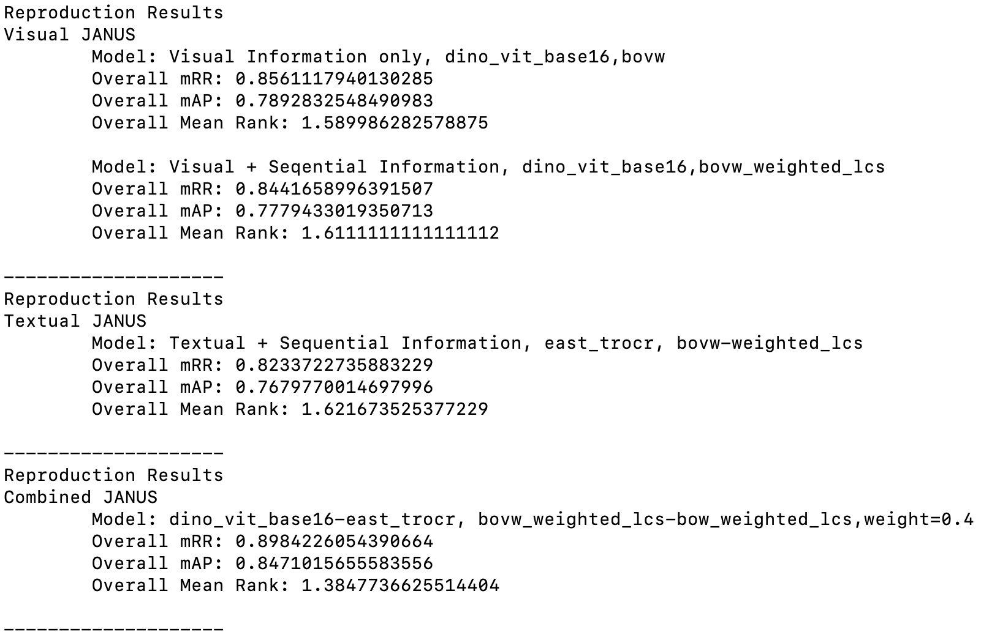
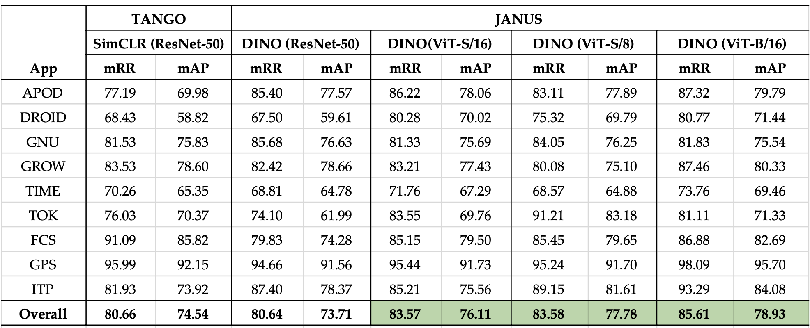
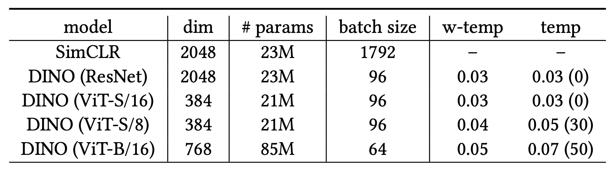
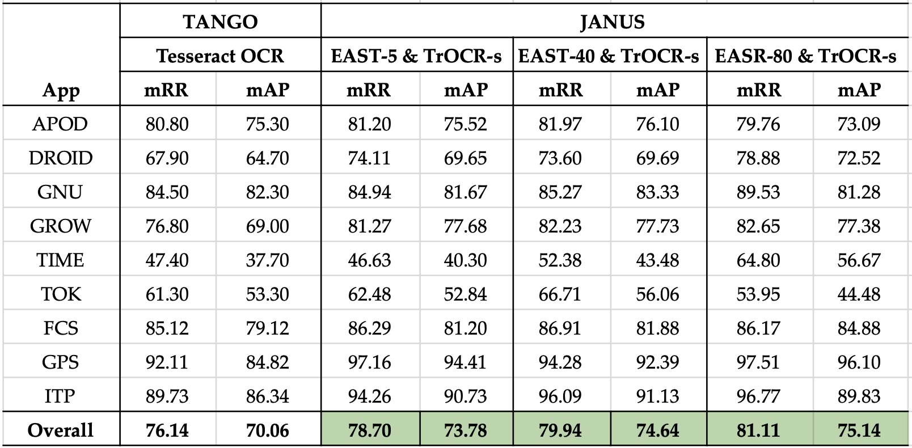
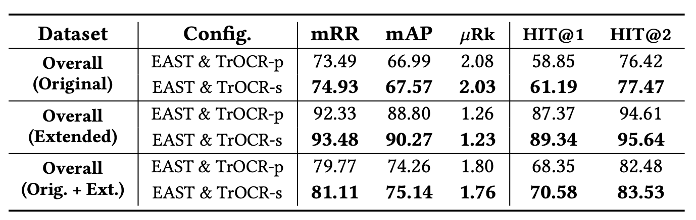

# Semantic GUI Scene Learning and Video Alignment for Detecting Duplicate Video-based Bug Reports
### Introduction
This is the official codebase for the paper "Semantic GUI Scene Learning and Video Alignment for Detecting Duplicate Video-based Bug Reports". We propose JANUS to advance the bug report management task of duplicate detection for video-based reports. JANUS adapts the scene-learning capabilities of vision transformers to capture subtle visual and textual patterns that manifest on app UI screens, as well as makes use of a video alignment technique capable of adaptive weighting of video frames to account for typical bug manifestation patterns.

### Data

All the data related to the benchmark and the project is provided in [Zenodo](Replication Package: https://doi.org/10.5281/zenodo.10455811).

* The video-based bug reports are located in the artifacts/videos folder
* The generated codebooks and the DINO model fine-tuned on Rico dataset for visual JANUS are in the artifacts/models/vision folder
* The required east checkpoint based on EAST & TrOCR can be found in the artifacts/models/text folder 
* The evaluation setting corresponding to 7,290 tasks is provided in the artifacts/evaluation_settings folder
* All the results for the visual, textual and combined JANUS are located in the outputs folder


### Installation

#### Prerequisites
- python 3.6
- download our latest replication package on [Zenodo](Replication Package: https://doi.org/10.5281/zenodo.10455811)
```bash
git clone https://github.com/yanyanfu/JANUS
cd JANUS
```

#### Installation via source code
```bash
pip install -r requirement.txt

(GPU - linux & windows) pip install torch==1.7.1+cu110 torchvision==0.8.2+cu110 torchaudio==0.7.2 -f https://download.pytorch.org/whl/torch_stable.html
(CPU - linux & windows) pip install torch==1.7.1+cpu torchvision==0.8.2+cpu torchaudio==0.7.2 -f https://download.pytorch.org/whl/torch_stable.html
(OSX) pip install torch==1.7.1 torchvision==0.8.2 torchaudio==0.7.2

apt-get install ffmpeg
cd janus
```


### Results

#### Reproduce the Results
```bash
python cli.py \
    --repro_path /projects/JANUS_reproduction_package \
    --arch  vit_base \
    --patch_size  16 \
    --results_type vision-text-seq \
    --cpu_mode 2>&1| tee log.txt
```

* repro_path: the path which saves the downloaded JANUS replication package.
* arch: the visual architecture to fine-tune, which can be chosen from [vit_base, vit_small]
* patch_size: patch resolution of the visual JANUS, which can be chosen from [8, 16]
* results_type: component used by JANUS, which can be chosen from [vision, text, vision-text, vision-text-seq
* cpu_mode: whether to use a cpu-only machine to conduct (textual) JANUS evaluation 

The expected output:



#### Other Fine-Grained Results

**Visual JANUS:** We compared our JANUS (visual) with the baseline TANGO (visual) by experimenting with two ViT models: ViT-Small (ViT-S) and ViT-Base (ViT-B). Although ViT-S has a **similar model size** to RestNet-50: ~23M parameters, the ViT-S (used by JANUS's DINO) outperform ResNet-50 (used by TANGO's SimCLR) with statistical significance on duplicate video-based bug report detection. 



The following table shows the network configurations and primary hyperparameters used by TANGO(visual) and JANUS(visual).



**Textual JANUS:** We compared JANUS (textual) against TANGO's textual component by experimenting with different configurations for the EAST and TrOCR models. For EAST, we used three different resolution thresholds to filter out small text regions: 5 x 5 (EAST-5), 40 x 20 (EAST-40), and 80 x 40 (EAST-80). For TrOCR, two fine-tuned TrOCR-Large models are used, namely TrOCR-p (fine-tuned on the printed text dataset SROIE) and  TrOCR-s (finetuned on the synthetic scene text datasets such as ICDAR15 and SVT)






