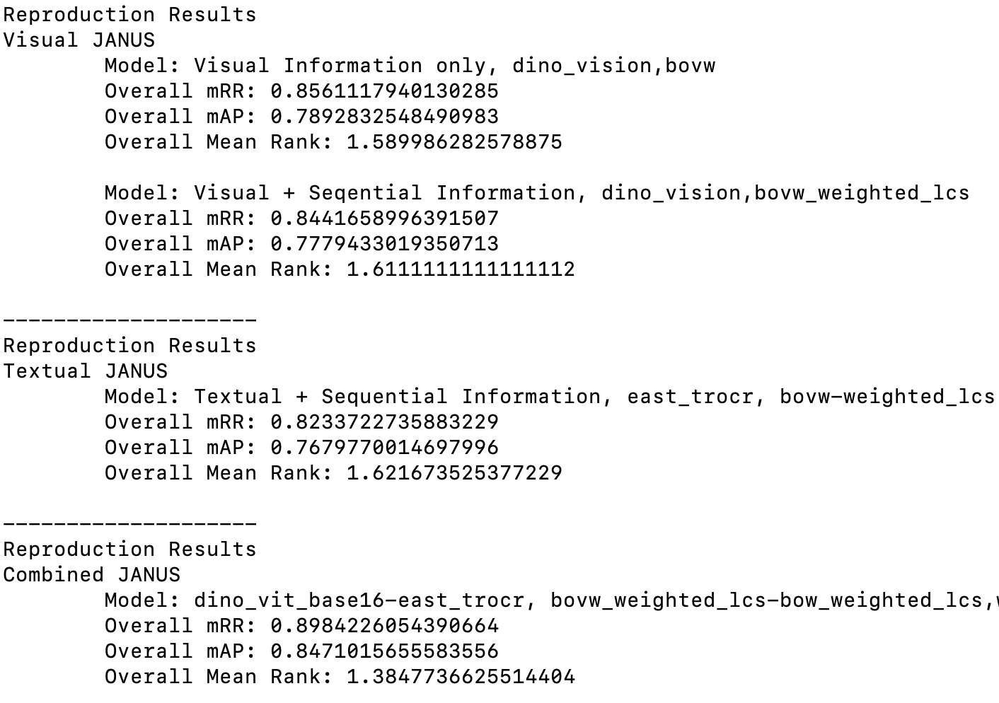

# Semantic GUI Scene Learning and Video Alignment for Detecting Duplicate Video-based Bug Reports
### Introduction
This is the official codebase for the paper "JANUS: Semantic GUI Scene Learning and Video Alignment for Detecting Duplicate Video-based Bug Reports". We propose JANUS to advance the bug report management task of duplicate
detection for video-based reports. JANUS adapts the scene-learning capabilities of vision transformers to capture subtle visual and textual patterns that manifest on app UI screens, as well as makes use of a video alignment technique capable of adaptive weighting of video frames to account for typical bug manifestation patterns.

### Data

All the data related to the benchmark and the approach itself is provided in [Zenodo](Replication Package: https://doi.org/10.5281/zenodo.10455812).

* The video-based bug reports are located in artifacts/videos folder
* The generated codebooks and the DINO model fine-tuned on Rico dataset for visual JANUS are in the artifacts/models/vision folder
* The required east checkpoint based on EAST & TrOCR can be found in the artifacts/models/text folder 
* The evaluation setting corresponding to 7,290 tasks is provided in the artifacts/evaluation_settings folder
* All the results for the visual, textual and combined JANUS are located in the outputs folder


### Installation

#### Prerequisites
- python 3.6
- download our online replication package on [Zenodo](Replication Package: https://doi.org/10.5281/zenodo.10455812)
```bash
git clone https://github.com/yanyanfu/JANUS
cd JANUS
```

#### Installation via source code
```bash
pip install -r requirement.txt

(GPU - linux & windows) pip install torch==1.7.1+cu110 torchvision==0.8.2+cu110 torchaudio==0.7.2 -f https://download.pytorch.org/whl/torch_stable.html
(CPU - linux & windows) pip install torch==1.7.1+cpu torchvision==0.8.2+cpu torchaudio==0.7.2 -f https://download.pytorch.org/whl/torch_stable.html
(OSX) pip install torch==1.7.1 torchvision==0.8.2 torchaudio==0.7.2

apt-get install ffmpeg
cd janus
```


### Results

#### Reproduce the Results
```bash
python cli.py \
    --repro_path /projects/JANUS_reproduction_package \
    --arch  vit_base \
    --patch_size  16 \
    --results_type vision-text-seq \
    --gpu False 2>&1| tee log.txt
```

* repro_path: the path which saves the downloaded JANUS replication package.
* arch: the visual architecture to fine-tune, which can be chosen from [vit_base, vit_small]
* patch_size: patch resolution of the visual JANUS, which can be chosen from [8, 16]
* results_type: component used by JANUS, which can be chosen from [vision, text, vision-text, vision-text-seq]
* gpu: whether to use gpu to conduct (textual) JANUS evaluation 

#### Examplar Results

The expected output:




